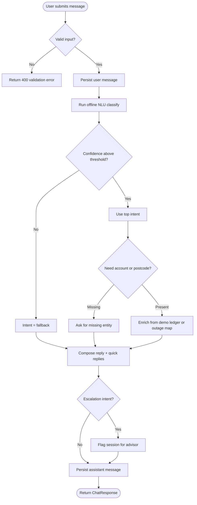

# Activity Diagram — Intent Handling

```mermaid
flowchart TD
  start([User submits message]) --> validate{Valid input?}
  validate -->|No| err[Return 400 validation error]
  validate -->|Yes| persistUser[Persist user message]
  persistUser --> nlu[Run offline NLU classify]
  nlu --> threshold{Confidence above threshold?}
  threshold -->|No| fallback[Intent = fallback]
  threshold -->|Yes| intent[Use top intent]
  fallback --> compose
  intent --> entities{Need account or postcode?}
  entities -->|Missing| ask[Ask for missing entity]
  entities -->|Present| enrich[Enrich from demo ledger or outage map]
  ask --> compose[Compose reply + quick replies]
  enrich --> compose
  compose --> escalate{Escalation intent?}
  escalate -->|Yes| flag[Flag session for advisor]
  escalate -->|No| save
  flag --> save[Persist assistant message]
  save --> respond([Return ChatResponse])
```
