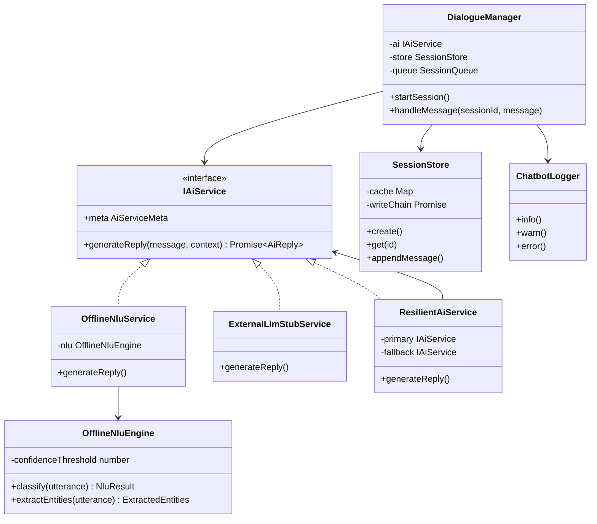

# Class Diagram

```mermaid
classDiagram
  class IAiService {
    <<interface>>
    +meta AiServiceMeta
    +generateReply(message, context) Promise~AiReply~
  }
  class OfflineNluService {
    -nlu OfflineNluEngine
    +generateReply()
  }
  class ExternalLlmStubService {
    +generateReply()
  }
  class ResilientAiService {
    -primary IAiService
    -fallback IAiService
    +generateReply()
  }
  class OfflineNluEngine {
    -confidenceThreshold number
    +classify(utterance) NluResult
    +extractEntities(utterance) ExtractedEntities
  }
  class DialogueManager {
    -ai IAiService
    -store SessionStore
    -queue SessionQueue
    +startSession()
    +handleMessage(sessionId, message)
  }
  class SessionStore {
    -cache Map
    -writeChain Promise
    +create()
    +get(id)
    +appendMessage()
  }
  class ChatbotLogger {
    +info()
    +warn()
    +error()
  }

  IAiService <|.. OfflineNluService
  IAiService <|.. ExternalLlmStubService
  IAiService <|.. ResilientAiService
  ResilientAiService --> IAiService
  OfflineNluService --> OfflineNluEngine
  DialogueManager --> IAiService
  DialogueManager --> SessionStore
  DialogueManager --> ChatbotLogger
```
