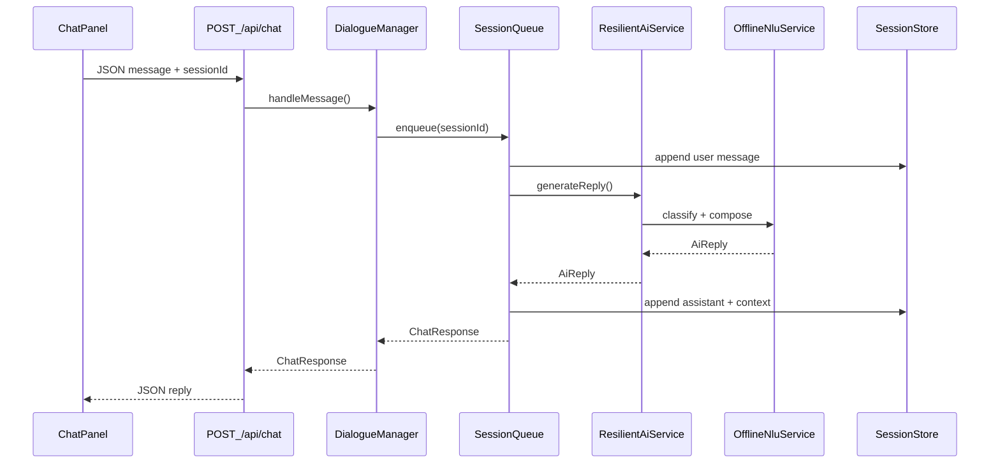

# Sequence Diagram — Chat Turn

```mermaid
sequenceDiagram
  participant UI as ChatPanel
  participant API as POST_/api/chat
  participant DM as DialogueManager
  participant Q as SessionQueue
  participant AI as ResilientAiService
  participant NLU as OfflineNluService
  participant Store as SessionStore

  UI->>API: JSON message + sessionId
  API->>DM: handleMessage()
  DM->>Q: enqueue(sessionId)
  Q->>Store: append user message
  Q->>AI: generateReply()
  AI->>NLU: classify + compose
  NLU-->>AI: AiReply
  AI-->>Q: AiReply
  Q->>Store: append assistant + context
  Q-->>DM: ChatResponse
  DM-->>API: ChatResponse
  API-->>UI: JSON reply
```
