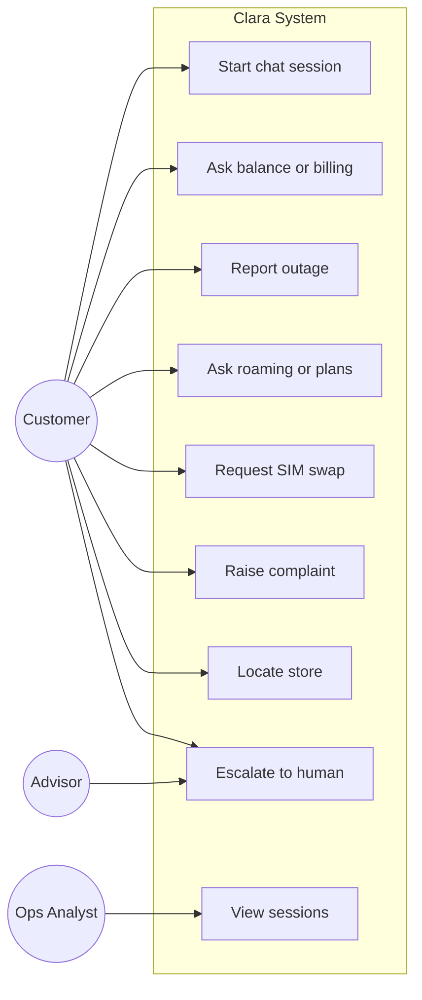

# Use Case Diagram

```mermaid
flowchart LR
  Customer((Customer))
  Advisor((Advisor))
  Ops((Ops Analyst))

  subgraph clara [Clara System]
    UC1[Start chat session]
    UC2[Ask balance or billing]
    UC3[Report outage]
    UC4[Ask roaming or plans]
    UC5[Request SIM swap]
    UC6[Raise complaint]
    UC7[Locate store]
    UC8[Escalate to human]
    UC9[View sessions]
  end

  Customer --> UC1
  Customer --> UC2
  Customer --> UC3
  Customer --> UC4
  Customer --> UC5
  Customer --> UC6
  Customer --> UC7
  Customer --> UC8
  Advisor --> UC8
  Ops --> UC9
```

## Primary actors

- **Customer** — seeks self-service answers.  
- **Advisor** — receives escalated sessions.  
- **Ops analyst** — monitors session volume and escalations.
